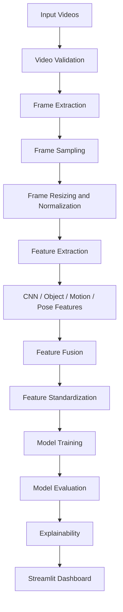

# Safe/Unsafe Video Classification using Machine Learning

End-to-end machine learning and computer vision project for classifying videos into **safe** and **unsafe** categories. The system extracts frame-level and video-level features, trains multiple classifiers, compares model performance, generates explainability outputs, and provides a Streamlit dashboard for demonstration.

## Key Features

- Binary video classification: `safe` vs `unsafe`
- Video validation and preprocessing
- Frame extraction, sampling, resizing, and normalization
- CNN/visual feature extraction
- YOLO/object-level feature support
- Motion, pose, activity, and contextual feature fusion
- Multiple ML classifiers
- Stacking ensemble learning
- SHAP/LIME-style explainability artifacts
- Streamlit dashboard
- Evaluation reports, plots, confusion matrices, and presentation assets

## Dataset Summary

Main processed feature file:

```text
Feature_Files/video_features_advanced_descriptive_with_dimensions.csv
```

| Item | Value |
| --- | ---: |
| Total videos | 497 |
| Safe videos | 250 |
| Unsafe videos | 247 |
| Main feature CSV columns | 533 |
| Numeric feature columns reported by audit | 515 |

The dataset is nearly balanced between safe and unsafe classes, which makes model comparison more reliable.

## Best Model Performance

The strongest available test-set model is **SVM**.

| Metric | Value |
| --- | ---: |
| Accuracy | 0.8467 |
| Precision | 0.8514 |
| Recall | 0.8400 |
| F1-score | 0.8456 |
| ROC-AUC | 0.9278 |
| PR-AUC | 0.9206 |

## Model Comparison

| Model | Accuracy | F1-score | ROC-AUC |
| --- | ---: | ---: | ---: |
| SVM | 0.8467 | 0.8456 | 0.9278 |
| Stacking Classifier | 0.8333 | 0.8276 | 0.9148 |
| KNN | 0.8200 | 0.8302 | 0.8835 |
| MLP Classifier | 0.8133 | 0.8228 | 0.8889 |
| XGBoost | 0.8067 | 0.8054 | 0.8948 |
| Logistic Regression | 0.8000 | 0.8052 | 0.8580 |
| Random Forest | 0.8000 | 0.7945 | 0.8866 |

## System Pipeline



## Repository Structure

```text
ML_project/
  Feature_Files/          Processed feature datasets
  Models/                 Trained models and optimization artifacts
  Presentation/           PPT and presentation visuals
  Results/                Metrics, plots, reports, confusion matrices
  Source_Code/
    preprocessing/        Video preprocessing and metadata scripts
    feature_engineering/  Feature extraction and fusion modules
    models/               ML model implementations
    evaluation/           Metrics and error analysis
    streamlit_app/        Dashboard application
    scripts/              Training and report generation scripts
    utils/                Shared helper utilities
  screenshots/            Dashboard and result screenshots
```

## Main Components

| Area | Files |
| --- | --- |
| Preprocessing | `Source_Code/preprocessing/video_preprocessing.py`, `prepare_dataset.py` |
| Feature extraction | `Source_Code/feature_engineering/video_features.py`, `cnn_feature_extraction.py`, `yolo_object_features.py` |
| Model training | `Source_Code/scripts/train.py`, `multi_model_pipeline.py` |
| ML models | `Source_Code/models/svm_model.py`, `random_forest.py`, `xgboost_model.py`, `stacking_classifier.py` |
| Evaluation | `Source_Code/evaluation/advanced_metrics.py`, `error_analysis.py` |
| Dashboard | `Source_Code/streamlit_app/app.py` |

## Installation

```bash
git clone <your-repository-url>
cd ML_project
python -m venv .venv
```

Windows:

```powershell
.\.venv\Scripts\activate
pip install -r requirements.txt
```

Linux/macOS:

```bash
source .venv/bin/activate
pip install -r requirements.txt
```

## Run Dashboard

```powershell
streamlit run Source_Code/streamlit_app/app.py
```

## Train Models

Run the full model pipeline:

```powershell
python Source_Code/scripts/multi_model_pipeline.py
```

Generate output artifacts:

```powershell
python Source_Code/scripts/generate_project_outputs.py
```

Run cross-validation:

```powershell
python Source_Code/scripts/cross_validate_models.py
```

## Important Outputs

| Output | Path |
| --- | --- |
| Metrics summary | `Results/metrics_summary.csv` |
| Classifier comparison | `Results/classifier_comparison.csv` |
| Cross-validation results | `Results/cross_validation_results.csv` |
| Confusion matrices | `Results/confusion_matrices/` |
| ROC curves | `Results/roc_curves/` |
| Explainability outputs | `Results/generated_project_outputs/` |
| Final presentation | `Presentation/Final_Project_Presentation.pptx` |

## Explainability

The project includes interpretable machine learning outputs:

- SHAP feature importance
- LIME local explanation sample
- Permutation importance
- Feature ranking CSV files
- Confusion matrix and ROC/PR visualizations

Important files:

```text
screenshots/shap_kernel_importance_top20.png
Results/generated_project_outputs/lime_explanation_sample.html
Results/generated_project_outputs/permutation_importance.csv
Results/generated_project_outputs/feature_importance_ranking.csv
```

## Project Outcome

The project demonstrates a complete video-classification workflow:

1. Convert videos into structured feature vectors
2. Train and compare multiple ML models
3. Select the best-performing model
4. Explain predictions using feature importance tools
5. Present predictions through an interactive dashboard

## Notes

- Large raw videos should not be committed to GitHub.
- Saved model artifacts are included only if repository size allows.
- Predictions should be treated as decision-support outputs and not as a replacement for human review in high-stakes safety scenarios.
