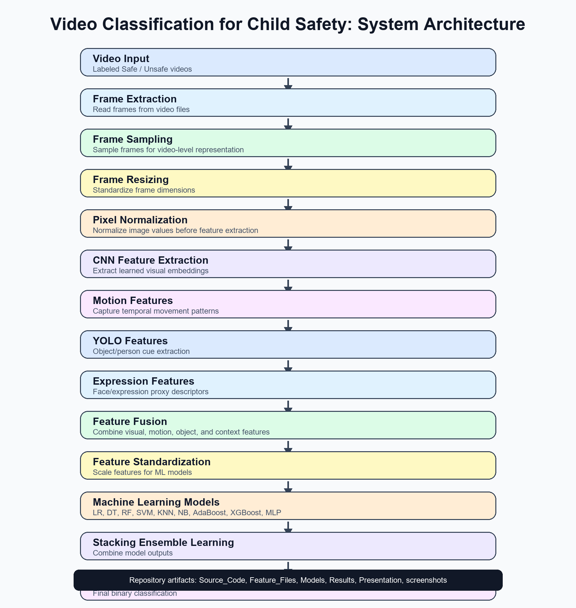
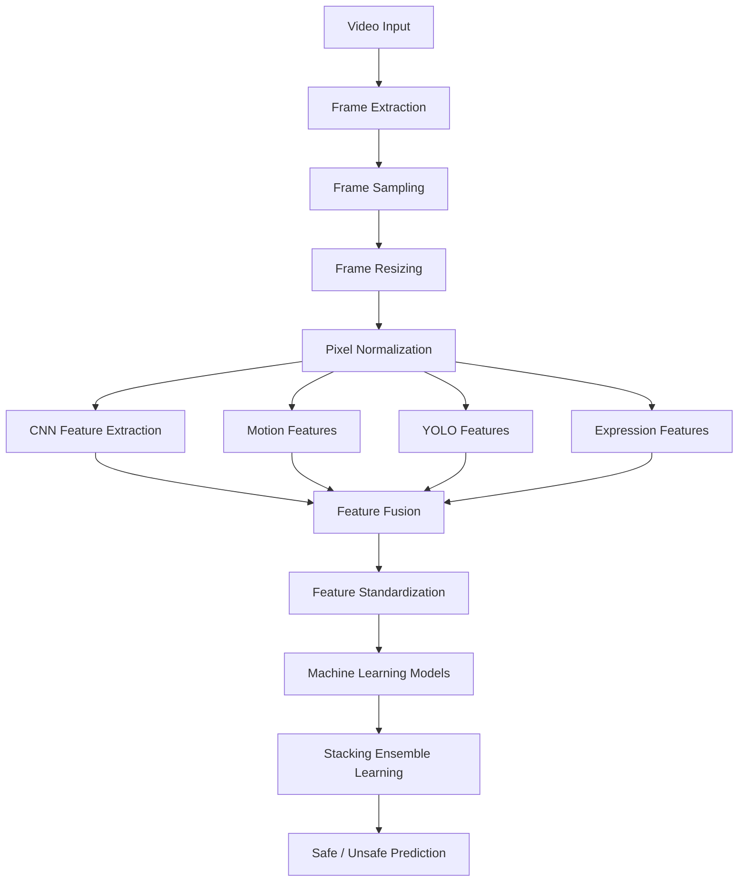
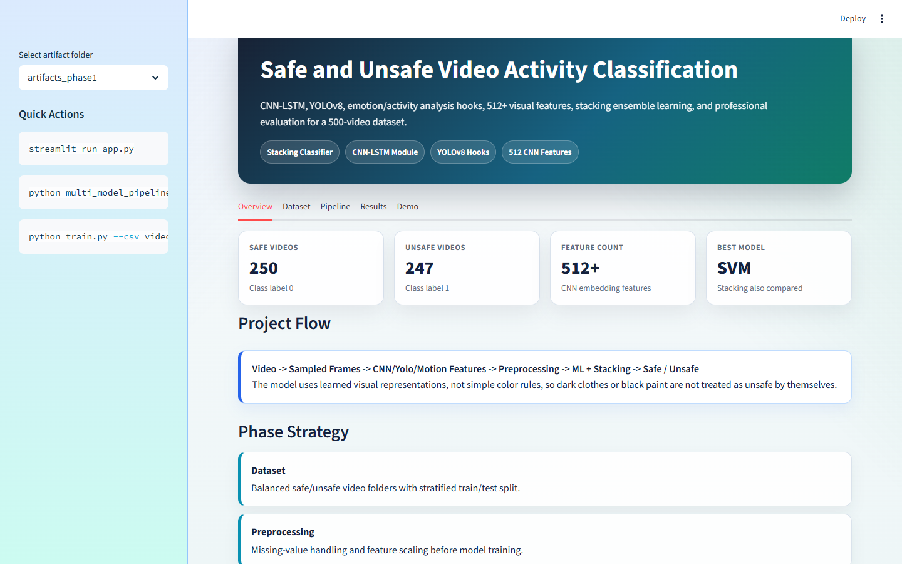

# Video Classification for Child Safety

Computer vision and machine learning pipeline for binary video classification into `safe` and `unsafe` classes. The repository includes video preprocessing, feature extraction, feature fusion, multiple machine learning classifiers, stacking ensemble learning, evaluation outputs, explainability artifacts, and a Streamlit application.



## Project Overview

This project processes labeled video files and converts them into model-ready feature vectors. The pipeline validates videos, samples and preprocesses frames, extracts visual and contextual features, trains multiple classifiers, evaluates performance with train/test metrics and 5-fold cross-validation, and provides a Streamlit interface for demonstration.

## Abstract

The repository implements an end-to-end Safe/Unsafe video classification system using frame-based computer vision features and supervised machine learning. The final feature dataset contains 497 videos with balanced class distribution. Multiple classifiers are compared, including Logistic Regression, Decision Tree, Random Forest, SVM, KNN, Naive Bayes, AdaBoost, XGBoost, MLP, and Stacking Classifier. Based on the available result files, the best test-set model is SVM with 0.8467 accuracy, 0.8456 F1-score, and 0.9278 ROC-AUC.

## Problem Statement

Given a labeled input video, predict whether the video belongs to the `safe` or `unsafe` class using extracted visual, motion, object, expression, activity, and safety-context features.

## Dataset Overview

The processed dataset is stored at:

`Feature_Files/video_features_advanced_descriptive_with_dimensions.csv`

Class labels:

| Class | Label | Count |
|---|---:|---:|
| safe | 0 | 250 |
| unsafe | 1 | 247 |

Dataset statistics:

| Item | Value |
|---|---:|
| Total videos | 497 |
| Current main feature CSV columns | 533 |
| Numeric feature columns reported by project audit | 515 |
| Safe videos | 250 |
| Unsafe videos | 247 |

## Complete Pipeline

1. Video input
2. Video validation
3. Frame extraction
4. Frame sampling
5. Frame resizing
6. Pixel normalization
7. CNN feature extraction
8. Motion feature extraction
9. YOLO/object feature extraction
10. Expression and activity feature extraction
11. Feature fusion
12. Feature standardization
13. Model training
14. Stacking ensemble learning
15. Evaluation and explainability
16. Safe/Unsafe prediction
17. Streamlit dashboard

## Architecture Diagram



PNG version: `architecture_diagram.png`

## Preprocessing

Preprocessing code is located in `Source_Code/preprocessing/`.

Important files:

- `video_preprocessing.py`: validation, frame extraction, resizing, and normalization helpers
- `feature_normalization.py`: feature scaling support
- `build_metadata.py`: dataset/video audit metadata creation
- `augmentation.py`: augmentation utilities

## CNN Feature Extraction

CNN-related feature extraction is implemented in:

- `Source_Code/feature_engineering/cnn_feature_extraction.py`
- `Source_Code/feature_engineering/cnn_feature_names.py`
- `Source_Code/models/transfer_backbones.py`

The project includes descriptive feature names for learned CNN embedding features. These names are presentation-friendly descriptions of learned activations and are not manually coded detectors.

## Feature Fusion

Feature fusion is implemented in:

`Source_Code/feature_engineering/video_fusion.py`

The fusion stage combines visual quality, motion/activity, object/person cues, expression proxies, pose/activity proxies, and safety-context proxy features into model-ready signals.

## Feature Standardization

Feature standardization is implemented in:

- `Source_Code/feature_engineering/feature_standardization.py`
- `Models/scaler.joblib`

Standardization supports models that are sensitive to feature scale, such as SVM, Logistic Regression, KNN, and MLP.

## Machine Learning Models

Model implementations are located in `Source_Code/models/`.

| Model | Source File |
|---|---|
| Logistic Regression | `logistic_regression.py` |
| Decision Tree | `decision_tree.py` |
| Random Forest | `random_forest.py` |
| SVM | `svm_model.py` |
| KNN | `knn_model.py` |
| Naive Bayes | `naive_bayes.py` |
| AdaBoost | `adaboost.py` |
| XGBoost | `xgboost_model.py` |
| MLP Classifier | `mlp_classifier.py` |
| Stacking Classifier | `stacking_classifier.py` |

Saved models are stored in `Models/`.

## Stacking Ensemble Learning

The stacking model is implemented in:

`Source_Code/models/stacking_classifier.py`

Saved stacking artifacts:

- `Models/stacking_model.joblib`
- `Models/artifacts_phase1/phase10_visual_stacking_classifier_model.joblib`
- `Models/artifacts_phase1/phase10_visual_stacking_classifier_confusion_matrix.png`

The stacking classifier test accuracy in the available results is 0.8333.

## Evaluation Metrics

The repository reports:

- Accuracy
- Precision
- Recall
- F1-score
- Specificity
- MCC
- ROC-AUC
- PR-AUC
- Log loss
- Confusion matrix
- 5-fold cross-validation

Metric implementations are located in `Source_Code/evaluation/`.

## Results Summary

Primary result files:

- `Results/metrics_summary.csv`
- `Results/classifier_comparison.csv`
- `Results/cross_validation_results.csv`
- `Results/generated_project_outputs/model_ranking.csv`

Model ranking by test accuracy:

| Model | Test Accuracy | Precision | Recall | F1-score | ROC-AUC |
|---|---:|---:|---:|---:|---:|
| SVM | 0.8467 | 0.8514 | 0.8400 | 0.8456 | 0.9278 |
| Stacking Classifier | 0.8333 | 0.8571 | 0.8000 | 0.8276 | 0.9148 |
| KNN | 0.8200 | 0.7857 | 0.8800 | 0.8302 | 0.8835 |
| MLP Classifier | 0.8133 | 0.7831 | 0.8667 | 0.8228 | 0.8889 |
| XGBoost | 0.8067 | 0.8108 | 0.8000 | 0.8054 | 0.8948 |
| Logistic Regression | 0.8000 | 0.7848 | 0.8267 | 0.8052 | 0.8580 |
| Random Forest | 0.8000 | 0.8169 | 0.7733 | 0.7945 | 0.8866 |
| Naive Bayes | 0.7800 | 0.7838 | 0.7733 | 0.7785 | 0.8408 |
| AdaBoost | 0.7800 | 0.8000 | 0.7467 | 0.7724 | 0.8631 |
| Decision Tree | 0.7733 | 0.8254 | 0.6933 | 0.7536 | 0.8012 |

## Cross Validation Summary

5-fold cross-validation results are stored in:

`Results/cross_validation_results.csv`

Top cross-validation result by mean accuracy:

| Model | CV Accuracy Mean | CV Accuracy Std | CV F1 Mean | CV ROC-AUC Mean |
|---|---:|---:|---:|---:|
| SVM | 0.8833 | 0.0119 | 0.8844 | 0.9463 |

## Confusion Matrix Results

Confusion matrices are stored in:

- `Results/confusion_matrices/`
- `screenshots/confusion_matrix_svm.png`

SVM classification report:

| Class | Precision | Recall | F1-score | Support |
|---|---:|---:|---:|---:|
| safe | 0.84 | 0.85 | 0.85 | 75 |
| unsafe | 0.85 | 0.84 | 0.85 | 75 |

## ROC-AUC Results

ROC and Precision-Recall visualizations are stored in:

- `Results/roc_curves/roc_curve.png`
- `Results/roc_curves/precision_recall_curve.png`
- `screenshots/roc_curve.png`
- `screenshots/precision_recall_curve.png`

Best ROC-AUC in the result files:

| Model | ROC-AUC |
|---|---:|
| SVM | 0.9278 |

## Explainability

Explainability outputs are stored in:

- `Results/generated_project_outputs/lime_explanation_sample.html`
- `Results/generated_project_outputs/lime_explanation_sample.csv`
- `Results/generated_project_outputs/shap_kernel_feature_importance.csv`
- `Results/generated_project_outputs/shap_kernel_importance_top20.png`

## Streamlit Application

Streamlit app files are stored in:

- `Source_Code/streamlit_app/app.py`
- `Source_Code/streamlit_app/ui.py`
- `Source_Code/streamlit_app/prediction_utils.py`
- `Source_Code/streamlit_app/visualization.py`

Screenshot:



## Folder Structure

```text
ML_project/
├── README.md
├── requirements.txt
├── .gitignore
├── architecture_diagram.png
├── results_summary.md
├── model_documentation.md
├── feature_documentation.md
├── evaluation_metrics.md
├── dataset_documentation.md
├── repository_structure.md
├── resume_project_summary.md
├── Feature_Files/
├── Models/
├── Presentation/
├── Results/
├── Source_Code/
└── screenshots/
```

## Installation Instructions

```bash
python -m venv .venv
.venv\Scripts\activate
pip install -r requirements.txt
```

## Usage Instructions

Run the Streamlit application:

```bash
streamlit run Source_Code/streamlit_app/app.py
```

Run training/evaluation scripts as needed:

```bash
python Source_Code/scripts/train.py
python Source_Code/scripts/multi_model_pipeline.py
python Source_Code/scripts/cross_validate_models.py
python Source_Code/scripts/generate_project_outputs.py
```

## Limitations

- The repository uses feature-based video classification rather than full end-to-end temporal video learning for the final reported classical ML results.
- Descriptive CNN feature names are explanation-friendly names for learned embedding dimensions, not exact manual detectors.
- The model results depend on the processed feature CSV and saved experiment outputs currently included in the repository.
- Safety-critical deployment would require larger validation datasets, additional robustness testing, and stricter false-negative analysis.

## Future Scope

- Add larger and more diverse video datasets.
- Add explicit temporal action-recognition baselines.
- Add ablation studies for each feature group.
- Add robustness tests for lighting, blur, resolution, compression, and frame-rate variation.
- Add automated tests for preprocessing, feature extraction, and prediction utilities.
- Package the project as an installable Python module.

## References

- Ultralytics YOLOv8 documentation and model files.
- scikit-learn documentation for classical ML models, metrics, cross-validation, and preprocessing.
- XGBoost documentation for gradient-boosted tree classification.
- LIME documentation for local interpretable model explanations.
- SHAP documentation for feature attribution.
- PyTorch and torchvision documentation for CNN/transfer-learning components.
